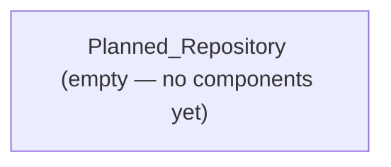

## Stack
No code exists in this repository yet. Per README.md: "Status: Planned — no code has been added yet." The repo contains only README.md, .gitignore, and .git — no manifest, no source files, no entry points to observe.

## Directory map
| path | what lives there |
|------|-------------------|
| README.md | Repo description; documents planned MERN e-commerce project (not yet implemented) |
| .gitignore | Standard git ignore rules |

## Diagram

## Component index
- [[Planned_Repository]]

## Entry points
- Dev entry point: TODO: verify (none exists; README describes a future `e-commerce/` folder with separate client/server, not yet created)
- Prod entry point: TODO: verify (not yet created)

## Conventions
- None observed — no source files exist to derive conventions from.

## Where things go
- To start the planned e-commerce app, create an `e-commerce/` folder as described in README.md (not yet present).
- To add a backend, it would live under `e-commerce/` per the README's "Install backend dependencies" step (path not yet created).
- To add a frontend, it would live under `e-commerce/client/` per the README's "Install frontend dependencies" step (path not yet created).
- Update README.md's "Status" line once code is actually added (per README.md line 5, self-noted).
